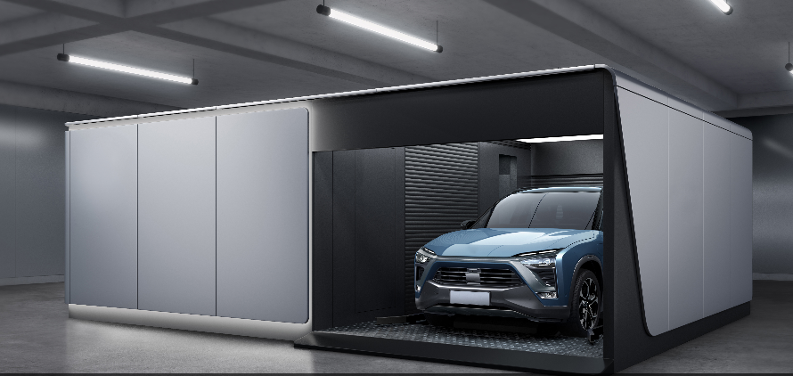

# BSS Simulation System App


### Set up Environment
```bash
git clone this_repo

pip install -r requirements.txt
```

### Run Simulator
```bash 
cd /path/to/this_repo_directory

streamlit run GUI.py
```
### Instructions
GUI.py：AppEntry file  

Swap，Users：Defined abstract class file  

main：The main file of the simulation function will be called by GUI.py  

global_param.py：Static parameter file  

image：Pictures that will be used, storage folders

data：*.dat files and storage folders that will be used

setup.sh：App configuration file, define background color, font size, etc.
